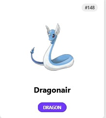
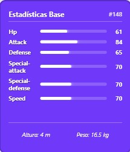

# ⚡ PokéCard Dex 151 - Angular Edition


Una Pokédex interactiva construida con **Angular**, que transforma la lista clásica de Pokémon en una colección de cartas coleccionables con animaciones 3D.


---

## ✨ Características Especiales

- 🃏 **Efecto de Giro 3D**: Al pasar el ratón por encima, la carta gira para mostrar estadísticas.
- 📊 **Dynamic Stats**: Visualización de estadísticas base (HP, Ataque, Defensa...) mediante barras de progreso dinámicas.
- 🎨 **Adaptive UI**: El color de la carta y las etiquetas cambian automáticamente según el tipo principal del Pokémon (Fuego, Agua, Planta, etc.).
- 🚀 **High Performance**: Consumo optimizado de la [PokéAPI](https://pokeapi.co/) utilizando componentes Standalone y servicios inyectables.

---

## 📸 Vista Previa

| Vista Frontal | Vista Trasera (Estadísticas) |
| :--- | :--- |
|  |  |


---

## 🛠️ Tecnologías Utilizadas

- **Framework:** Angular (v18/19)
- **Lenguaje:** TypeScript
- **Estilos:** CSS3 nativo (CSS Grid, Flexbox, Perspective 3D)
- **API:** PokeAPI v2

---

## 📦 Instalación y Uso

Si quieres probar este proyecto localmente, sigue estos pasos:

1. **Clonar el repositorio:**
   ```bash
   git clone [https://github.com/TU_USUARIO/angular-pokedex.git](https://github.com/TU_USUARIO/angular-pokedex.git)
   
2. **Instalar dependencias:**

Bash
cd angular-pokedex
npm install

3. **Ejecutar el servidor de desarrollo:**

Bash
ng serve
Abre tu navegador en http://localhost:4200/.

💡 **Aprendizajes del Proyecto**

Este proyecto me permitió profundizar en:

Consumo de APIs REST asíncronas con HttpClient y Observables.

Manejo de animaciones CSS 3D complejas.

Estructuración de servicios y componentes Standalone en Angular moderno.

Hecho con ❤️ por Alejandro Miras Andújar